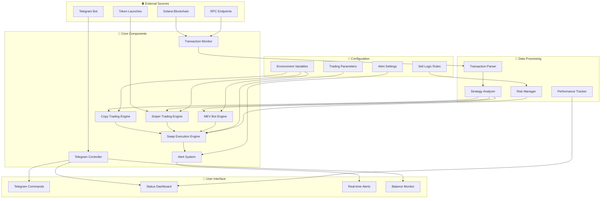
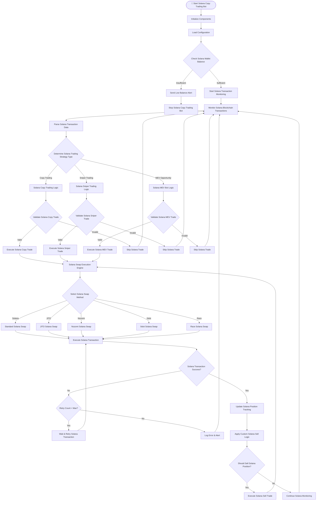
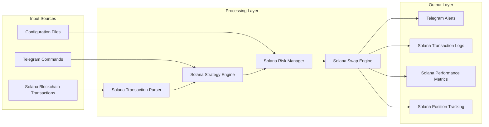

# 🚀 Solana Copy Trading Bot - Advanced MEV & Sniper pump bonk 0~1 block

> **The most advanced Solana copy trading bot with MEV capabilities, sniper trading, and offchain transaction signing for maximum speed and efficiency. Trade on PumpFun, PumpSwap, BonkFun, and Raydium with lightning-fast execution.**

[](https://nodejs.org/)
[](https://solana.com/)
[](https://telegram.org/)
[](LICENSE)

## 📋 Table of Contents
- [Features](#-features)
- [Architecture](#️-architecture)
- [Quick Start](#-quick-start)
- [Telegram Commands](#-telegram-commands)
- [Advanced Configuration](#️-advanced-configuration)
- [Technical Details](#-technical-details)
- [Performance Monitoring](#-performance-monitoring)
- [Security Features](#️-security-features)
- [Supported DEX Platforms](#-supported-dex-platforms)
- [Trading Strategies](#-trading-strategies)
- [Troubleshooting](#️-troubleshooting)
- [Support](#-support)

## 🌟 Features

### 🎯 **Core Trading Capabilities**
- **Copy Trading**: Automatically replicate successful trades from target wallets
- **Sniper Trading**: Lightning-fast token launch detection and execution
- **MEV Bot**: Capture arbitrage opportunities and front-run transactions
- **Multi-DEX Support**: Trade on PumpFun, PumpSwap, BonkFun, and Raydium
- **Real-time Monitoring**: 24/7 blockchain transaction monitoring

### ⚡ **High-Speed Solana Transaction Execution**
- **0slot Integration**: Zero-slot transaction execution for maximum Solana trading speed
- **Nozomi Support**: Advanced Solana transaction routing and optimization
- **Offchain Signing**: Pre-built Solana transaction signing for reduced latency
- **gRPC Communication**: High-performance communication with 0block for Solana
- **Shred Stream Processing**: Real-time Solana blockchain data processing

### 🔧 **Advanced Solana Copy Trading Bot Features**
- **Multi-Method Swapping**: Support for Solana, JITO, Nozomi, 0slot, and Race methods
- **Custom Sell Logic**: Advanced exit strategies with stop-loss and take-profit for Solana trades
- **Risk Management**: Comprehensive risk controls and position sizing for Solana trading
- **Performance Tracking**: Real-time PnL monitoring and statistics for Solana copy trading
- **Error Recovery**: Robust error handling and automatic retry mechanisms for Solana transactions

### 📱 **Telegram Interface for Solana Copy Trading Bot**
- **Remote Control**: Complete Solana copy trading bot control via Telegram commands
- **Real-time Alerts**: Instant notifications for Solana trades, errors, and balance updates
- **Interactive Dashboard**: Live status monitoring and configuration for Solana copy trading
- **Customizable Alerts**: Configurable notification preferences for Solana trading bot
- **Balance Monitoring**: Automatic Solana wallet balance tracking

## 🏗️ Solana Copy Trading Bot Architecture

### **Solana Copy Trading Bot System Architecture Overview**



### **Solana Copy Trading Bot Transaction Flow Diagram**



### **Solana Copy Trading Bot Data Flow Architecture**



## 🚀Solana Copy Trading Bot Quick Start

### **Prerequisites for Solana Copy Trading Bot**
- Node.js 18+ 
- Solana CLI tools
- Telegram Bot Token
- Solana wallet with SOL balance

### **Installation of Solana Copy Trading Bot**

```bash
# Clone the Solana copy trading bot repository
git clone https://github.com/hanshaze/solana-copy-trading-bot.git
cd solana-copy-trading-bot

# Install dependencies for Solana copy trading bot
npm install

# Copy environment template for Solana copy trading bot
cp .env.example .env

# Configure your Solana copy trading bot environment variables
nano .env
```

### **Solana Copy Trading Bot Environment Configuration**

```env
# Solana Configuration for Copy Trading Bot
RPC_URL=https://api.mainnet-beta.solana.com
PRIVATE_KEY=your_private_key_here

# Telegram Configuration for Solana Copy Trading Bot
TELEGRAM_BOT_TOKEN=your_bot_token
TELEGRAM_CHAT_ID=your_chat_id

# Solana Copy Trading Bot Configuration
SWAP_METHOD=nozomi  # Options: solana, jito, nozomi, 0slot, race
SLIPPAGE_BPS=50
MAX_RETRIES=3
RETRY_DELAY=1000

# Solana Copy Trading Bot Balance Limits
LIMIT_BALANCE=0.1

# Nozomi Configuration for Solana Copy Trading Bot (if using Nozomi)
NOZOMI_URL=your_nozomi_url
NOZOMI_UUID=your_nozomi_uuid
NOZOMI_TIP_LAMPORTS=200000

# JITO Configuration for Solana Copy Trading Bot (if using JITO)
JITO_TIP=100000
PRIORITIZATION_FEE_LAMPORTS=10000
```

### **Running the Solana Copy Trading Bot**

```bash
# Start the Solana copy trading bot
npm start

# Or run Solana copy trading bot directly with Node.js
node index.js
```

## 📱 Telegram Commands for Solana Copy Trading Bot

### **Main Commands for Solana Copy Trading Bot**
- `/start` - Show main control panel for Solana copy trading bot
- `/status` - Check Solana copy trading bot status and balance
- `/balance` - Check Solana wallet balance
- `/alerts` - Manage alert settings for Solana copy trading bot
- `/stats` - View Solana copy trading bot trading statistics
- `/help` - Show all Solana copy trading bot commands

### **Interactive Controls for Solana Copy Trading Bot**
- **Start Bot** - Begin Solana copy trading operations
- **Stop Bot** - Halt all Solana copy trading activities
- **Refresh** - Update Solana copy trading bot status and balance
- **Settings** - Configure Solana copy trading bot parameters

## ⚙️ Advanced Configuration

### **Solana Copy Trading Bot Swap Methods**

#### **Standard Solana**
```javascript
SWAP_METHOD=solana
```
Standard Solana transaction execution with basic prioritization fees for copy trading.

#### **JITO Integration for Solana Copy Trading Bot**
```javascript
SWAP_METHOD=jito
JITO_TIP=100000
```
JITO MEV-boost integration for enhanced Solana transaction routing in copy trading.

#### **Nozomi Integration for Solana Copy Trading Bot**
```javascript
SWAP_METHOD=nozomi
NOZOMI_URL=your_nozomi_endpoint
NOZOMI_UUID=your_uuid
NOZOMI_TIP_LAMPORTS=200000
```
Nozomi integration for advanced Solana transaction optimization and routing in copy trading.

#### **0slot Integration for Solana Copy Trading Bot**
```javascript
SWAP_METHOD=0slot
```
Zero-slot Solana transaction execution for maximum speed and efficiency in copy trading.

#### **Race Method for Solana Copy Trading Bot**
```javascript
SWAP_METHOD=race
```
Race-based Solana transaction execution for competitive copy trading environments.

### **Custom Sell Logic for Solana Copy Trading Bot**

The Solana copy trading bot implements advanced sell logic with multiple exit strategies:

```javascript
// Example sell logic configuration for Solana copy trading bot
const sellLogic = {
  stopLoss: 0.1,        // 10% stop loss for Solana trades
  takeProfit: 0.5,      // 50% take profit for Solana trades
  trailingStop: 0.05,   // 5% trailing stop for Solana trades
  timeBasedExit: 3600,  // Exit Solana position after 1 hour
  customRules: []       // Custom exit conditions for Solana copy trading
};
```

### **Risk Management for Solana Copy Trading Bot**

```javascript
// Risk management parameters for Solana copy trading bot
const riskConfig = {
  maxPositionSize: 0.1,     // Maximum 10% of balance per Solana trade
  maxDailyLoss: 0.2,        // Maximum 20% daily loss for Solana copy trading
  minBalance: 0.1,          // Minimum Solana balance threshold
  maxRetries: 3,            // Maximum Solana transaction retries
  retryDelay: 1000          // Retry delay in milliseconds for Solana copy trading
};
```

## 🔧 Technical Details

### **Solana Copy Trading Bot Transaction Parsing**

The Solana copy trading bot supports advanced transaction parsing for multiple DEX platforms:

- **PumpFun**: 233-byte Solana transaction format
- **PumpSwap**: 368-byte Solana transaction format  
- **Raydium LaunchLab**: 146-byte Solana transaction format
- **Raydium**: Standard Raydium Solana transaction format

### **Offchain Transaction Signing for Solana Copy Trading Bot**

```javascript
// Offchain Solana transaction signing example for copy trading bot
import { offchainSwap } from './swap(offchain).js';

const swapResult = await offchainSwap({
  fromToken: 'SOL',
  toToken: 'TOKEN_MINT',
  amount: '1000000000',
  walletAddress: 'YOUR_WALLET_ADDRESS'
});
```

### **gRPC Integration for Solana Copy Trading Bot**

The Solana copy trading bot uses gRPC for high-performance communication with 0block:

```javascript
// gRPC client configuration for Solana copy trading bot
const grpcClient = new GrpcClient({
  endpoint: 'your_0block_endpoint',
  credentials: 'your_credentials'
});
```

### **Shred Stream Processing for Solana Copy Trading Bot**

Real-time Solana blockchain data processing using shred streams:

```javascript
// Shred stream processing for Solana copy trading bot
const shredStream = new ShredStream({
  endpoint: 'your_shred_endpoint',
  onData: (shred) => {
    // Process Solana shred data for copy trading
    processShredData(shred);
  }
});
```

## 📊 Performance Monitoring for Solana Copy Trading Bot

### **Real-time Metrics for Solana Copy Trading Bot**
- **Transaction Success Rate**: Track successful vs failed Solana transactions
- **Average Execution Time**: Monitor Solana transaction speed
- **PnL Tracking**: Real-time profit/loss monitoring for Solana copy trading
- **Position Tracking**: Active Solana position management
- **Balance Monitoring**: Solana wallet balance tracking

### **Alert System for Solana Copy Trading Bot**
- **Buy Alerts**: Notifications for successful Solana purchases
- **Sell Alerts**: Notifications for Solana position exits
- **Error Alerts**: System error notifications for Solana copy trading bot
- **Balance Alerts**: Low Solana balance warnings
- **Performance Alerts**: Performance threshold notifications for Solana copy trading

## 🛡️ Security Features

### **Solana Wallet Security**
- **Private Key Management**: Secure private key handling for Solana copy trading bot
- **Balance Validation**: Pre-trade Solana balance verification
- **Transaction Validation**: Post-trade Solana confirmation
- **Error Recovery**: Automatic error handling and recovery for Solana copy trading

### **Risk Controls for Solana Copy Trading Bot**
- **Position Sizing**: Automatic Solana position size calculation
- **Stop Loss**: Configurable stop-loss mechanisms for Solana trades
- **Take Profit**: Automated take-profit execution for Solana positions
- **Daily Limits**: Daily loss and trade limits for Solana copy trading

## 🔄 Supported DEX Platforms for Solana Copy Trading Bot

### **PumpFun**
- **Transaction Format**: 233 bytes for Solana copy trading
- **Features**: Virtual AMM, creator fees for Solana copy trading bot
- **Integration**: Full Solana transaction parsing and execution

### **PumpSwap**
- **Transaction Format**: 368 bytes for Solana copy trading
- **Features**: LP fees, protocol fees for Solana copy trading bot
- **Integration**: Complete Solana swap execution support

### **BonkFun**
- **Features**: Meme token trading on Solana
- **Integration**: Standard Solana swap execution for copy trading

### **Raydium**
- **Features**: AMM trading, liquidity pools on Solana
- **Integration**: Full Raydium protocol support for Solana copy trading

## 📈 Trading Strategies for Solana Copy Trading Bot

### **Solana Copy Trading Strategy**
1. **Target Selection**: Choose successful Solana wallets to copy
2. **Transaction Monitoring**: Real-time Solana transaction tracking
3. **Strategy Analysis**: Analyze Solana trading patterns
4. **Execution**: Replicate successful Solana trades
5. **Position Management**: Apply custom sell logic for Solana copy trading

### **Solana Sniper Trading Strategy**
1. **Launch Detection**: Monitor new Solana token launches
2. **Analysis**: Evaluate Solana launch parameters
3. **Execution**: Fast Solana token purchase execution
4. **Position Tracking**: Monitor Solana position performance
5. **Exit Strategy**: Apply sniper-specific sell logic for Solana copy trading

### **Solana MEV Bot Strategy**
1. **Opportunity Detection**: Monitor Solana mempool for arbitrage
2. **Profit Calculation**: Calculate potential MEV profit on Solana
3. **Execution**: Execute MEV transactions on Solana
4. **Position Management**: Manage MEV positions on Solana
5. **Exit Strategy**: Optimize MEV exit timing for Solana copy trading

## 🚨 Troubleshooting

### **Common Issues with Solana Copy Trading Bot**

#### **Insufficient Solana Balance**
```
Error: Insufficient balance for Solana copy trading
Solution: Add SOL to your Solana wallet
```

#### **Solana Transaction Failures**
```
Error: Solana transaction failed after retries
Solution: Check RPC endpoint and Solana network connectivity
```

#### **Telegram Bot Issues for Solana Copy Trading Bot**
```
Error: Telegram bot not responding for Solana copy trading bot
Solution: Verify bot token and chat ID configuration
```

### **Performance Optimization for Solana Copy Trading Bot**

#### **High Latency in Solana Copy Trading**
- Use dedicated Solana RPC endpoints
- Enable Nozomi or 0slot integration for Solana copy trading
- Optimize network configuration for Solana copy trading bot

#### **Solana Transaction Failures**
- Increase prioritization fees for Solana copy trading
- Use alternative swap methods for Solana copy trading
- Check Solana wallet balance

## 📝Solana Copy Trading Bot License

This Solana copy trading bot project is licensed under the MIT License - see the [LICENSE](LICENSE) file for details.

## 🤝 Contributing

1. Fork the Solana copy trading bot repository
2. Create your feature branch (`git checkout -b feature/AmazingFeature`)
3. Commit your changes (`git commit -m 'Add some AmazingFeature'`)
4. Push to the branch (`git push origin feature/AmazingFeature`)
5. Open a Pull Request for the Solana copy trading bot

## ⚠️Solana Copy Trading Bot Disclaimer

This Solana copy trading bot software is for educational and research purposes only. Trading cryptocurrencies on Solana involves significant risk and may result in the loss of your capital. You should carefully consider whether Solana copy trading is suitable for you in light of your financial condition. The authors are not responsible for any losses incurred through the use of this Solana copy trading bot software.


## 📞 Support

- **Telegram**: [@hanshazee](https://t.me/hanshazee)
- **Email**: hicrs423@gmail.com
- **Issues**: [GitHub Issues](https://github.com/hanshaze/solana-copy-trading-bot/issues)
- **Repository**: [GitHub](https://github.com/hanshaze/solana-copy-trading-bot)

---

**⭐ Star this Solana copy trading bot repository if you find it helpful!**

**�� Happy Trading!** 
