# 🚀 Solana Copy Trading Bot - Advanced MEV & Sniper Trading System

[](https://nodejs.org/)
[](https://solana.com/)
[](https://telegram.org/)
[](LICENSE)

> **Advanced Solana copy trading bot with MEV capabilities, sniper trading, and offchain transaction signing for maximum speed and efficiency.**

## 🌟 Features

### 🎯 **Core Trading Capabilities**
- **Copy Trading**: Automatically replicate successful trades from target wallets
- **Sniper Trading**: Lightning-fast token launch detection and execution
- **MEV Bot**: Capture arbitrage opportunities and front-run transactions
- **Multi-DEX Support**: Trade on PumpFun, PumpSwap, BonkFun, and Raydium
- **Real-time Monitoring**: 24/7 blockchain transaction monitoring

### ⚡ **High-Speed Transaction Execution**
- **0slot Integration**: Zero-slot transaction execution for maximum speed
- **Nozomi Support**: Advanced transaction routing and optimization
- **Offchain Signing**: Pre-built transaction signing for reduced latency
- **gRPC Communication**: High-performance communication with 0block
- **Shred Stream Processing**: Real-time blockchain data processing

### 🔧 **Advanced Technical Features**
- **Multi-Method Swapping**: Support for Solana, JITO, Nozomi, 0slot, and Race methods
- **Custom Sell Logic**: Advanced exit strategies with stop-loss and take-profit
- **Risk Management**: Comprehensive risk controls and position sizing
- **Performance Tracking**: Real-time PnL monitoring and statistics
- **Error Recovery**: Robust error handling and automatic retry mechanisms

### 📱 **Telegram Interface**
- **Remote Control**: Complete bot control via Telegram commands
- **Real-time Alerts**: Instant notifications for trades, errors, and balance updates
- **Interactive Dashboard**: Live status monitoring and configuration
- **Customizable Alerts**: Configurable notification preferences
- **Balance Monitoring**: Automatic wallet balance tracking

## 🏗️ Architecture

### **System Architecture Overview**


### **Transaction Flow Diagram**

```mermaid
flowchart TD
    Start([🚀 Start Bot]) --> Init[Initialize Components]
    Init --> Config[Load Configuration]
    Config --> CheckBalance{Check Wallet Balance}
    
    CheckBalance -->|Sufficient| StartMonitoring[Start Transaction Monitoring]
    CheckBalance -->|Insufficient| AlertLowBalance[Send Low Balance Alert]
    AlertLowBalance --> StopBot[Stop Bot]
    
    StartMonitoring --> MonitorTx[Monitor Blockchain Transactions]
    MonitorTx --> ParseTx[Parse Transaction Data]
    
    ParseTx --> Strategy{Determine Strategy Type}
    
    Strategy -->|Copy Trading| CopyLogic[Copy Trading Logic]
    Strategy -->|Sniper Trading| SniperLogic[Sniper Trading Logic]
    Strategy -->|MEV Opportunity| MEVLogic[MEV Bot Logic]
    
    CopyLogic --> ValidateCopy{Validate Copy Trade}
    SniperLogic --> ValidateSniper{Validate Sniper Trade}
    MEVLogic --> ValidateMEV{Validate MEV Trade}
    
    ValidateCopy -->|Valid| ExecuteCopy[Execute Copy Trade]
    ValidateSniper -->|Valid| ExecuteSniper[Execute Sniper Trade]
    ValidateMEV -->|Valid| ExecuteMEV[Execute MEV Trade]
    
    ValidateCopy -->|Invalid| SkipCopy[Skip Trade]
    ValidateSniper -->|Invalid| SkipSniper[Skip Trade]
    ValidateMEV -->|Invalid| SkipMEV[Skip Trade]
    
    ExecuteCopy --> SwapEngine[Swap Execution Engine]
    ExecuteSniper --> SwapEngine
    ExecuteMEV --> SwapEngine
    
    SwapEngine --> SwapMethod{Select Swap Method}
    
    SwapMethod -->|Solana| StandardSwap[Standard Solana Swap]
    SwapMethod -->|JITO| JitoSwap[JITO Swap]
    SwapMethod -->|Nozomi| NozomiSwap[Nozomi Swap]
    SwapMethod -->|0slot| ZeroSlotSwap[0slot Swap]
    SwapMethod -->|Race| RaceSwap[Race Swap]
    
    StandardSwap --> ExecuteTransaction[Execute Transaction]
    JitoSwap --> ExecuteTransaction
    NozomiSwap --> ExecuteTransaction
    ZeroSlotSwap --> ExecuteTransaction
    RaceSwap --> ExecuteTransaction
    
    ExecuteTransaction --> Success{Transaction Success?}
    
    Success -->|Yes| UpdatePosition[Update Position Tracking]
    Success -->|No| RetryLogic{Retry Count < Max?}
    
    RetryLogic -->|Yes| RetryDelay[Wait & Retry]
    RetryLogic -->|No| LogError[Log Error & Alert]
    
    RetryDelay --> ExecuteTransaction
    LogError --> MonitorTx
    
    UpdatePosition --> SellLogic[Apply Custom Sell Logic]
    SellLogic --> ShouldSell{Should Sell?}
    
    ShouldSell -->|Yes| ExecuteSell[Execute Sell Trade]
    ShouldSell -->|No| ContinueMonitoring[Continue Monitoring]
    
    ExecuteSell --> SwapEngine
    ContinueMonitoring --> MonitorTx
    
    SkipCopy --> MonitorTx
    SkipSniper --> MonitorTx
    SkipMEV --> MonitorTx
```



### **Data Flow Architecture**


## 🚀 Quick Start

### **Prerequisites**
- Node.js 18+ 
- Solana CLI tools
- Telegram Bot Token
- Solana wallet with SOL balance

### **Installation**

```bash
# Clone the repository
git clone https://github.com/hanshaze/solana-copy-trading-bot.git
cd solana-copy-trading-bot

# Install dependencies
npm install

# Copy environment template
cp .env.example .env

# Configure your environment variables
nano .env
```

### **Environment Configuration**

```env
# Solana Configuration
RPC_URL=https://api.mainnet-beta.solana.com
PRIVATE_KEY=your_private_key_here

# Telegram Configuration
TELEGRAM_BOT_TOKEN=your_bot_token
TELEGRAM_CHAT_ID=your_chat_id

# Trading Configuration
SWAP_METHOD=nozomi  # Options: solana, jito, nozomi, 0slot, race
SLIPPAGE_BPS=50
MAX_RETRIES=3
RETRY_DELAY=1000

# Balance Limits
LIMIT_BALANCE=0.1

# Nozomi Configuration (if using Nozomi)
NOZOMI_URL=your_nozomi_url
NOZOMI_UUID=your_nozomi_uuid
NOZOMI_TIP_LAMPORTS=200000

# JITO Configuration (if using JITO)
JITO_TIP=100000
PRIORITIZATION_FEE_LAMPORTS=10000
```

### **Running the Bot**

```bash
# Start the bot
npm start

# Or run directly with Node.js
node index.js
```

## 📱 Telegram Commands

### **Main Commands**
- `/start` - Show main control panel
- `/status` - Check bot status and balance
- `/balance` - Check wallet balance
- `/alerts` - Manage alert settings
- `/stats` - View trading statistics
- `/help` - Show all commands

### **Interactive Controls**
- **Start Bot** - Begin trading operations
- **Stop Bot** - Halt all trading activities
- **Refresh** - Update status and balance
- **Settings** - Configure bot parameters

## ⚙️ Advanced Configuration

### **Swap Methods**

#### **Standard Solana**
```javascript
SWAP_METHOD=solana
```
Standard Solana transaction execution with basic prioritization fees.

#### **JITO Integration**
```javascript
SWAP_METHOD=jito
JITO_TIP=100000
```
JITO MEV-boost integration for enhanced transaction routing.

#### **Nozomi Integration**
```javascript
SWAP_METHOD=nozomi
NOZOMI_URL=your_nozomi_endpoint
NOZOMI_UUID=your_uuid
NOZOMI_TIP_LAMPORTS=200000
```
Nozomi integration for advanced transaction optimization and routing.

#### **0slot Integration**
```javascript
SWAP_METHOD=0slot
```
Zero-slot transaction execution for maximum speed and efficiency.

#### **Race Method**
```javascript
SWAP_METHOD=race
```
Race-based transaction execution for competitive trading environments.

### **Custom Sell Logic**

The bot implements advanced sell logic with multiple exit strategies:

```javascript
// Example sell logic configuration
const sellLogic = {
  stopLoss: 0.1,        // 10% stop loss
  takeProfit: 0.5,      // 50% take profit
  trailingStop: 0.05,   // 5% trailing stop
  timeBasedExit: 3600,  // Exit after 1 hour
  customRules: []       // Custom exit conditions
};
```

### **Risk Management**

```javascript
// Risk management parameters
const riskConfig = {
  maxPositionSize: 0.1,     // Maximum 10% of balance per trade
  maxDailyLoss: 0.2,        // Maximum 20% daily loss
  minBalance: 0.1,          // Minimum balance threshold
  maxRetries: 3,            // Maximum transaction retries
  retryDelay: 1000          // Retry delay in milliseconds
};
```

## 🔧 Technical Details

### **Transaction Parsing**

The bot supports advanced transaction parsing for multiple DEX platforms:

- **PumpFun**: 233-byte transaction format
- **PumpSwap**: 368-byte transaction format  
- **Raydium LaunchLab**: 146-byte transaction format
- **Raydium**: Standard Raydium transaction format

### **Offchain Transaction Signing**

```javascript
// Offchain transaction signing example
import { offchainSwap } from './swap(offchain).js';

const swapResult = await offchainSwap({
  fromToken: 'SOL',
  toToken: 'TOKEN_MINT',
  amount: '1000000000',
  walletAddress: 'YOUR_WALLET_ADDRESS'
});
```

### **gRPC Integration**

The bot uses gRPC for high-performance communication with 0block:

```javascript
// gRPC client configuration
const grpcClient = new GrpcClient({
  endpoint: 'your_0block_endpoint',
  credentials: 'your_credentials'
});
```

### **Shred Stream Processing**

Real-time blockchain data processing using shred streams:

```javascript
// Shred stream processing
const shredStream = new ShredStream({
  endpoint: 'your_shred_endpoint',
  onData: (shred) => {
    // Process shred data
    processShredData(shred);
  }
});
```

## 📊 Performance Monitoring

### **Real-time Metrics**
- **Transaction Success Rate**: Track successful vs failed transactions
- **Average Execution Time**: Monitor transaction speed
- **PnL Tracking**: Real-time profit/loss monitoring
- **Position Tracking**: Active position management
- **Balance Monitoring**: Wallet balance tracking

### **Alert System**
- **Buy Alerts**: Notifications for successful purchases
- **Sell Alerts**: Notifications for position exits
- **Error Alerts**: System error notifications
- **Balance Alerts**: Low balance warnings
- **Performance Alerts**: Performance threshold notifications

## 🛡️ Security Features

### **Wallet Security**
- **Private Key Management**: Secure private key handling
- **Balance Validation**: Pre-trade balance verification
- **Transaction Validation**: Post-trade confirmation
- **Error Recovery**: Automatic error handling and recovery

### **Risk Controls**
- **Position Sizing**: Automatic position size calculation
- **Stop Loss**: Configurable stop-loss mechanisms
- **Take Profit**: Automated take-profit execution
- **Daily Limits**: Daily loss and trade limits

## 🔄 Supported DEX Platforms

### **PumpFun**
- **Transaction Format**: 233 bytes
- **Features**: Virtual AMM, creator fees
- **Integration**: Full transaction parsing and execution

### **PumpSwap**
- **Transaction Format**: 368 bytes
- **Features**: LP fees, protocol fees
- **Integration**: Complete swap execution support

### **BonkFun**
- **Features**: Meme token trading
- **Integration**: Standard Solana swap execution

### **Raydium**
- **Features**: AMM trading, liquidity pools
- **Integration**: Full Raydium protocol support

## 📈 Trading Strategies

### **Copy Trading**
1. **Target Selection**: Choose successful wallets to copy
2. **Transaction Monitoring**: Real-time transaction tracking
3. **Strategy Analysis**: Analyze trading patterns
4. **Execution**: Replicate successful trades
5. **Position Management**: Apply custom sell logic

### **Sniper Trading**
1. **Launch Detection**: Monitor new token launches
2. **Analysis**: Evaluate launch parameters
3. **Execution**: Fast token purchase execution
4. **Position Tracking**: Monitor position performance
5. **Exit Strategy**: Apply sniper-specific sell logic

### **MEV Bot**
1. **Opportunity Detection**: Monitor mempool for arbitrage
2. **Profit Calculation**: Calculate potential MEV profit
3. **Execution**: Execute MEV transactions
4. **Position Management**: Manage MEV positions
5. **Exit Strategy**: Optimize MEV exit timing

## 🚨 Troubleshooting

### **Common Issues**

#### **Insufficient Balance**
```
Error: Insufficient balance for trading
Solution: Add SOL to your wallet
```

#### **Transaction Failures**
```
Error: Transaction failed after retries
Solution: Check RPC endpoint and network connectivity
```

#### **Telegram Bot Issues**
```
Error: Telegram bot not responding
Solution: Verify bot token and chat ID configuration
```

### **Performance Optimization**

#### **High Latency**
- Use dedicated RPC endpoints
- Enable Nozomi or 0slot integration
- Optimize network configuration

#### **Transaction Failures**
- Increase prioritization fees
- Use alternative swap methods
- Check wallet balance

## 📝 License

This project is licensed under the MIT License - see the [LICENSE](LICENSE) file for details.

## 🤝 Contributing

1. Fork the repository
2. Create your feature branch (`git checkout -b feature/AmazingFeature`)
3. Commit your changes (`git commit -m 'Add some AmazingFeature'`)
4. Push to the branch (`git push origin feature/AmazingFeature`)
5. Open a Pull Request

## ⚠️ Disclaimer

This software is for educational and research purposes only. Trading cryptocurrencies involves significant risk and may result in the loss of your capital. You should carefully consider whether trading is suitable for you in light of your financial condition. The authors are not responsible for any losses incurred through the use of this software.


## 📞 Support

- **Telegram**: [@hanshazee](https://t.me/hanshazee)
- **Email**: hicrs423@gmail.com
- **Issues**: [GitHub Issues](https://github.com/hanshaze/solana-copy-trading-bot/issues)
- **Repository**: [GitHub](https://github.com/hanshaze/solana-copy-trading-bot)

---

**⭐ Star this repository if you find it helpful!**

**�� Happy Trading!** 